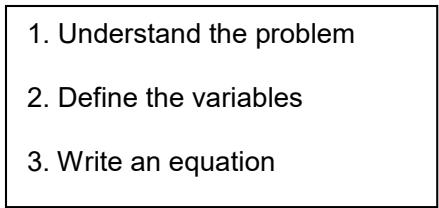
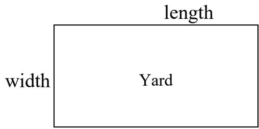
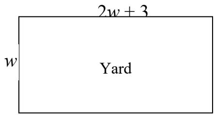
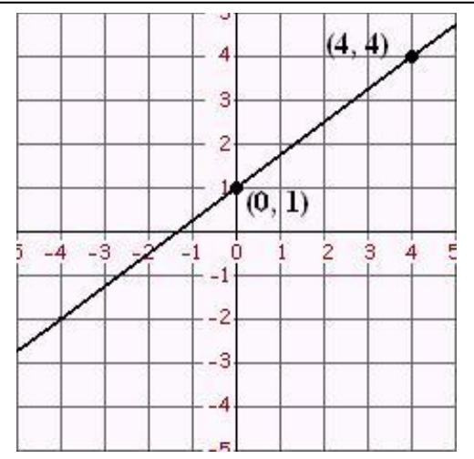
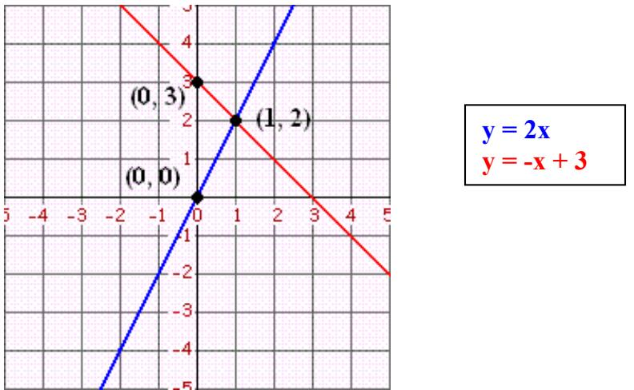
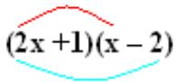
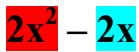
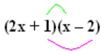
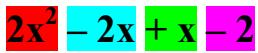

# A Quick Algebra Review

1 Simplifying Expressions   
2. Solving Equations   
3 Problem Solving   
4. Inequalities   
5 Absolute Values   
6. Linear Equations   
7 Systems of Equations   
8 Laws of Exponents   
9. Quadratics   
10. Rationals   
11. Radicals

# Simplifying Expressions

An expression is a mathematical “phrase.” Expressions contain numbers and variables, but not an equal sign. An equation has an “equal” sign. For example:

$$
\begin{array} { c } { 5 + 3 } \\ { \mathrm { x } + 3 } \\ { ( \mathrm { x } + 4 ) ( \mathrm { x } - 2 ) } \\ { \mathrm { x } ^ { 2 } + 5 \mathrm { x } + 6 } \\ { \mathrm { x } - 8 } \end{array}
$$

$$
\begin{array} { c } { 5 + 3 = 8 } \\ { \mathrm { x } + 3 = 8 } \\ { ( \mathrm { x } + 4 ) ( \mathrm { x } - 2 ) = 1 0 } \\ { \mathrm { x } ^ { 2 } + 5 \mathrm { x } + 6 = 0 } \\ { \mathrm { x } - 8 > 3 } \end{array}
$$

When we simplify an expression, we work until there are as few terms as possible. This process makes the expression easier to use, (that’s why it’s called “simplify”). The first thing we want to do when simplifying an expression is to combine like terms.

For example:

There are many terms to look at! Let’s start with $\mathbf { X } ^ { 2 }$ . There are no other terms with $\mathbf { X } ^ { 2 }$ in them, so we move on. $1 0 \mathrm { x }$ and ${ 5 } \mathrm { x }$ are like terms, so we add their coefficients together. $1 0 + ( - 5 ) = 5$ , so we write 5x. -6 and 4 are also like terms, so we can combine them to get $^ { - 2 }$ . Isn’t the simplified expression much nicer?

# Simplify:

$$
\begin{array} { l } { { \bf x } ^ { 2 } + 1 0 { \bf x } - 6 - 5 { \bf x } + 4 } \\ { = { \bf x } ^ { 2 } + 5 { \bf x } - 6 + 4 } \\ { = { \bf x } ^ { 2 } + 5 { \bf x } - 2 } \end{array}
$$

# Order of Operations

PEMDAS – Please Excuse My Dear Aunt Sally, remember that from Algebra class? It tells the order in which we can complete operations when solving an equation. First, complete any work inside PARENTHESIS, then evaluate EXPONENTS if there are any. Next MULTIPLY or DIVIDE numbers before ADDING or SUBTRACTING. For example:

# Simplify:

Inside the parenthesis, look for more order of operation rules - PEMDAS. We don’t have any exponents, but we do need to multiply before we subtract, then add inside the parentheses before we multiply by negative 2 on the outside.

-2[3 - (-2)(6)] $= - 2 [ 3 - ( - 1 2 ) ]$   
= -2[3+12]   
$= - 2 [ 1 5 ]$   
= -30

Let’s try another one…

Inside the parenthesis, look for order of operation rules - PEMDAS.

We need to subtract 5 from 3 then add 12 inside the parentheses. This takes care of the $\mathrm { P }$ in PEMDAS, now for the E, Exponents. We square -4. Make sure to use $\left( - 4 \right) ^ { 2 }$ if you are relying on your calculator. If you input $- \overline { { 4 } } ^ { 2 }$ the calculator will evaluate the expression using PEMDAS. It will do the exponent first, then multiply by -1, giving you -16, though we know the answer is 16. Now we can multiply and then add to finish up.

Practice makes perfect…

Since there are no like terms inside the parenthesis, we need to distribute the negative sign and then see what we have. There is really a -1 there but we’re basically lazy when it comes to the number one and don’t always write it (since 1 times anything is itself). So we need to take -1 times EVERYTHING in the parenthesis, not just the first term. Once we have done that, we can combine like terms and rewrite the expression.

# Now you try:

[you should get -18x $+ 2 0$ ]

# Simplify:

$$
\begin{array} { r l } & { ( - 4 ) ^ { 2 } + 2 [ 1 2 + ( 3 - 5 ) ] } \\ & { = ( - 4 ) ^ { 2 } + 2 [ 1 2 + ( - 2 ) ] } \\ & { = ( - 4 ) ^ { 2 } + 2 [ 1 0 ] } \\ & { = 1 6 + 2 [ 1 0 ] } \\ & { = 1 6 + 2 [ 1 0 ] } \\ & { = 1 6 + 2 0 } \\ & { = 3 6 } \end{array}
$$

Simplify:

$$
\begin{array} { r l } & { ( 5 \mathtt { a } ^ { 2 } - 3 \mathtt { a } + 1 ) - ( 2 \mathtt { a } ^ { 2 } - 4 \mathtt { a } + 6 ) } \\ & { = ( 5 \mathtt { a } ^ { 2 } - 3 \mathtt { a } + 1 ) - 1 ( 2 \mathtt { a } ^ { 2 } - 4 \mathtt { a } + 6 ) } \\ & { = ( 5 \mathtt { a } ^ { 2 } - 3 \mathtt { a } + 1 ) - 1 ( 2 \mathtt { a } ^ { 2 } ) - ( - 1 ) ( - 4 \mathtt { a } ) + ( - 1 ) ( 6 ) } \\ & { = ( 5 \mathtt { a } ^ { 2 } - 3 \mathtt { a } + 1 ) - 2 \mathtt { a } ^ { 2 } + 4 \mathtt { a } - 6 } \\ & { = \frac { 5 \mathtt { a } ^ { 2 } - 3 \mathtt { a } + 1 } { 5 } - 2 \mathtt { a } ^ { 2 } + 4 \mathtt { a } - 6 } \\ & { = 3 \mathtt { a } ^ { 2 } + 3 \mathtt { a } - 5 } \end{array}
$$

# Solving Equations

An equation has an equal sign. The goal of solving equations is to get the variable by itself, to SOLVE for $\mathbf { X } = .$ . In order to do this, we must “undo” what was done to the problem initially. Follow reverse order of operations – look for addition/subtraction first, then multiplication/division, then exponents, and parenthesis. The important rule when solving an equation is to always do to one side of the equal sign what we do to the other.

For example

Solve: $\mathbf { x } + 9 = . 6$ -9 -9 $\mathbf { x } = - 1 5$

To solve an equation we need to get our variable by itself. To “move” the 9 to the other side, we need to subtract 9 from both sides of the equal sign, since 9 was added to $\mathbf { X }$ in the original problem. Then we have $\mathbf { x } + 9 - 9 = \mathbf { - } 6 - 9$ so $\mathbf { x } + 0 = - 1 5$ or just $\mathbf { x } = - 1 5$ .

Solve:   
$5 { \mathrm { x } } - 7 = 2$ $+ 7 + 7$ $5 \mathbf { X } = 9$ 5x = 9 5 5 x = 9/5

When the equations get more complicated, just remember to “undo” what was done to the problem initially using PEMDAS rules BACKWARDS and move one thing at a time to leave the term with the variable until the end. They subtract 7; so we add 7 (to both sides). They multiply by 5; we divide by five.

When there are variables on both sides of the equation, add or subtract to move them to the same side, then get the term with the variable by itself. Remember, we can add together terms that are alike!

Solve:   
$7 ( \mathrm { x } + 4 ) = 6 \mathrm { x } + 2 4$   
distribute   
$7 { \bf x } + 2 8 = 6 { \bf x } + 2 4$ -28 - 28 $7 \mathrm { x } = 6 \mathrm { x } - 4$ -6x -6x $\mathbf { x } = \mathbf { - } 4$

Your Turn: $2 ( \mathrm { x } - \mathrm { l } ) = - 3$ (you should get $\mathbf { x } = - 1 / 2$ )

# Problem Solving

Many people look at word problems and think, “I’m really bad at these!” But once we accept them, they help us solve problems in life when the equation, numbers, and variables are not given to us. They help us THINK, logically.

One of the challenging parts of solving word problems is that you to take a problem given in written English and translate it into a mathematical equation. In other words, we turn words into numbers, variables, and mathematical symbols.

There are three important steps to “translating” a word problem into an equation we can work with:

Let’s look at an example:

The fence around my rectangular back yard is 48 feet long. My yard is 3ft longer than twice the width. What is the width of my yard? What is the length?

First, we have to make sure we understand the problem. So what’s going on here? Drawing a picture often helps with this step.

We know that the problem is describing a person’s rectangular yard. We also know that one side is the width and the other side is the length. The perimeter of (distance around) the yard is 48ft. To arrive at that perimeter, we add length $^ +$ length $^ +$ width $^ +$ width, or use the formula $2 l + 2 w = p$ (cd:) $l =$ length, $w =$ width, $p =$ perimeter)

Next, we have to define the variables:

The problem also states, “The length of my yard is 3ft more than twice the width.” This means that if I know the We know the perimeter is width, I can multiply it by 2 48ft, but we do not know tand add 3 to determine the length length.

Let’s have $w =$ the width. We find the length by multiplying the width by 2 and adding 3, so length $= 2 w + 3$ . Let’s add these labels to the picture.

Now, we write an equation.

$$
p = 2 l + 2 w
$$

$$
4 8 = 2 ( 2 w + 3 ) + 2 w
$$

To write the equation we substitute our variables into the equation for the perimeter. The formula already calls for $w$ , so we can just leave that as is. Where it calls for length, we can just plug in $^ { \mathfrak { s } } 2 w + 3 ^ { \mathfrak { s } }$ . We already know our perimeter is 48ft, so we substitute that in for $p$ .

To solve the equation:

$$
4 8 = 2 ( 2 w + 3 ) + 2 w
$$

Use the distributive property to multiply 2 by $2 w$ and 3.   
Combine like terms $4 w$ and $2 w$ ).   
Subtract 6 from both sides to “undo” the addition.   
Divide by 6 on both sides to “undo” the multiplication.   
You are left with a width of 7 ft. Now we need to find the length.

Check to see that it works

Substitute our newly found width and simplify using order of operations $\circleddot$

2(7) + 3   
14 + 3

So now we know that the yard is 7ft wide and 17ft long.

17ft $=$ length

# Your turn:

I have a box. The length of the box is 12 in. The height of the box is 5 in. The box has a total volume of 360 in.2 What is the width of the box?

Note: The formula for volume is $V = l w h$ , where $\nu =$ volume, $l =$ length, $w =$ width, and $h =$ height.

(You should get $w = 6 \mathrm { i n } .$ .)

# Inequalities

We’ve all been taught little tricks to remember the inequality sign. For example; when given $\mathbf { x } < 1 0$ , we know that x is less than ten because x has the LITTLE side of the sign and 10 has the BIG side of the sign.

Solving inequalities is similar to solving equations; what you do to one side of an inequality, we must do to the other. If we are given $\mathbf { x } + 7 > 1 3$ and asked to solve, we would undo the addition on the left side by subtracting 7 from both sides. We would then be left with $\mathbf { \Delta x } > \mathbf { 6 }$ , which is our answer.

Suppose we were given $\mathbf { 1 } _ { / 4 } \mathbf { x } < 2$ . To undo the division, we would multiply both sides by 4. The result would be $\mathbf { x } < \mathbf { 8 }$ .

But if we had – $- \sqrt [ 1 ] { 4 \mathbf { \lambda } } \mathbf { X } < 2$ , we would multiply by both sided of the inequality by $^ { - 4 }$ and the rule is that when multiplying (or dividing) by a negative number, we must always flip the sign of an inequality. So we would get $\mathbf { x } > 2$ .

Let’s practice:

Just as with an equation, we start here by dividing both sides by -2. Since we are dividing by a negative, we must flip the inequality sign.

Next, we add five to both sides and we are left with $\mathbf { x } > 0$ .

$$
\mathbf { x } > 0
$$

It’s always good to check our answer. To do this, plug values in for x. Let’s try 1, since it is greater than 0 and an easier number to work with. 1 – 5 is - 4. -4 times $^ { - 2 }$ is -8.

Is - $\mathbf { - 8 < 1 0   ? }$ You bet!

Your turn: $4 \mathrm { x } + 2 > 1 0$

[You should get $\mathbf { x } > 2$ ]

# Absolute Values

The absolute value of a number is its distance from zero on the number line.   
Since we can’t have negative distance, absolute values are always positive.

$$
\begin{array} { c } { { \mid 5 \mid = 5 } } \\ { { \mid \neg 7 \mid = 7 } } \\ { { \mid \neg 8 + 2 \mid = 6 } } \end{array}
$$

When solving absolute value equations, we must consider that the number inside could have been negative before you applied the absolute value!

For example: $\left| \mathbf { \nabla } _ { \mathbf { X } } + 2 \mathbf { \nabla } \right| = 3$

$$
\underbrace { \mathbf { x } + 2 } _ { \begin{array} { l } { \mathbf { \Delta } } \end{array} } \quad \begin{array} { l } { \mathrm { a n d } \quad \quad \mathbf { x } + 2 } \\ { \mathbf { \Delta } } \end{array}
$$

When we take the absolute value, both are equal to 3.

So we end up with TWO SOLUTIONS for this equation.

$$
\begin{array} { r l r } { \mathbf { x } + 2 = 3 } & { { } \mathrm { a n d } } & { \mathbf { x } + 2 = - 3 } \\ { - 1 } & { { } - 1 } & { - 2 \qquad - 2 } \\ { \mathbf { x } = 1 } & { { } } & { \mathbf { x } = - 5 } \end{array}
$$

[You should get $\mathbf { { x } } = - 1 / 3$ and $\mathbf { x } = 3$ ]

# Linear Equations

If we plot all the solutions to a linear equation on a graph, they form a line. That is why they are called linear equations. Linear equations can be written in slope-intercept form. There are two important things to know when writing the equation of a line in slope-intercept form; the slope and the y-intercept.

The slope of the line gives the rate of change. Remember slope is rise over the run. That is because from any point on the line, the “direction” to another point on the line is given in terms of the x and y coordinates, how much it “rises,” goes up (or if negative, down) and “runs” (moves in the horizontal direction). For example, if the slope is 2/3; from any point on your line to get to another point on your line we would move positive (up) 2 and positive (to the right) 3. The y-intercept is the point where the line crosses the y axis.

Slope-intercept form is written where the equation is solved for y:

$$
\mathbf { y } = \mathbf { m } \mathbf { x } + \mathbf { b }
$$

where m is the slope and $\mathbf { b }$ is the y-intercept.

To find the slope of a line that is not written in slope intercept form, we must solve the equation for y.

For example:

Find the slope and y-intercept of the line $3 \mathrm { x } - 2 \mathrm { y } = 4$ .

We need to put the equation in slope intercept form. Then we can quickly identify the parts by their position in the equation.

$$
\begin{array} { c } { 3 \mathrm { x } - 2 \mathrm { y } = 4 } \\ { - 3 \mathrm { x } } \\ { \frac { - 2 \mathrm { y } } { - 2 } = \frac { - 3 \mathrm { x } + 4 } { - 2 } } \end{array}
$$

To solve we subtract $3 \mathbf { x }$ from both sides of the equation. Be careful to note that the 2y remaining is negative. Then divide both sides by -2.

$$
\mathbf { y } = \underline { { 3 \mathbf { x } } } - 2
$$

Now it is easy to compare the   
equation we have to the slope-intercept form and identify the slope and the y-intercept of this line.

$$
\mathrm { y } = \frac { 3 \mathrm { x } - 2 } { 2 }
$$

$\mathbf { y } = \mathbf { m } \mathbf { x } + \mathbf { b }$ , so the slope, $\mathrm { m } { = } 3 / 2$ and the y-intercept, $\scriptstyle \mathtt { b } = \mathtt { - } 2$

Your turn: Find the slope and y-intercept of the linear equation $\mathbf { x } - 3 \mathbf { y } = - 6$

[You should get $\mathrm { m } = 1 / 3$ and ${ \mathsf b } = 2$ ]

# Writing the Equation of a Line in Slope Intercept Form

Let’s try this example:

What is the equation of a line that has a slope of $-$ and the point $( 9 , 2 ) ?$

Since we know that lines can be written in the form $\mathbf { y } = \mathbf { m } \mathbf { x } + \mathbf { b }$ , use this equation as a template and substitute the information that you have into the equation to find the y-intercept.

$$
\begin{array} { l } { \mathbf { y } = \mathbf { \phi } _ { \mathbf { x } } + \mathbf { b } } \\ { 2 = { \mathbf { \phi } } ( 9 ) + \mathbf { b } } \\ { 2 = - 2 ( 3 ) + \mathbf { b } } \\ { 2 = - 6 + \mathbf { b } } \\ { 2 + 6 = \mathbf { b } } \\ { 8 = \mathbf { b } } \end{array}
$$

Substitute $- 2 / 3$ in for the slope m, and (9, 2) in for the point $( \mathbf { x } , \mathbf { y } )$ in the equation.

Now you have everything you need to write the equation of the line with slope $- 2 / 3$ through the point (9,2). Put the slope and y-intercept back into the equation and you have $\mathbf { y } = - 2 / 3 \mathbf { x } + \overline { { 8 } }$

Sometimes, the slope isn’t given. Let’s try another example:

Find the equation of a line that passes through the points (3, 1) and (6, 2).

The first thing we need to do is find the slope of the line through these two points.

Remember that:

$$
{ \mathrm { s l o p e } } = { \mathrm { m } } = { \frac { y _ { 2 } - y _ { 1 } } { x _ { 2 } - x _ { 1 } } }
$$

$$
\begin{array} { l } { { \displaystyle { \mathfrak { m } } = { \frac { 2 - 1 } { 6 - 3 } } } } \\ { { } } \\ { { \displaystyle { \mathfrak { m } } = { \frac { 1 } { 3 } } } } \end{array}
$$

No one is trying to confuse you with all of these subscripts…Its just that we have two points $( \mathbf { x } , \mathbf { y } )$ so we call the first one $( \mathbf { x } _ { 1 } , \mathbf { y } _ { 1 } )$ and the second $\left( \mathbf { { x } } _ { 2 } , \mathbf { { y } } _ { 2 } \right)$ Substitute (3, 1) in for one point and (6, 2) in for the other. Be careful to go the same direction when you subtract and WATCH YOUR SIGNS!

Now we can substitute the slope and one of the points (either one will work) into the equation $\mathbf { y } = \mathbf { m } \mathbf { x } + \mathbf { b }$ and solve for b.

We’ll use the point (3, 1) for (x, y)

$$
\begin{array} { l } { { \bf { y } } ^ { = } = { \bf { x } } + { \bf { b } } } \\ { \quad 1 = \quad \quad ( 3 ) + { \bf { b } } } \\ { \quad 1 = 1 + { \bf { b } } } \\ { \quad 1 - 1 = { \bf { b } } } \\ { 0 = { \bf { b } } } \end{array}
$$

Now we have everything we need to write the equation of the line with points (3, 1) and (6, 2). We found that the slope $\mathrm { m } = 1 / 3$ then we found the y-intercept. Putting them into the equation you have $\mathbf { y } = 1 / 3 \mathbf { x } + 0$

Your turn: Find the equation of the line that goes through the points (5, 4) and (1, -4).

[You should get $\mathbf { y } = 2 \mathbf { x } - 6 ]$

# Graphing Linear Equations

To graph linear equations from the y-intercept form begin by plotting the yintercept on the graph. From this point, use the slope to find another point on the line.

For example: Graph the equation $\mathbf { y } = \% \mathbf { x } + \mathbf { 1 }$

Since our y-intercept is 1, we know that the point $( 0 , 1 )$ will be on our line.

From this point, we will use our slope to find another point. The slope (3/4) is $\left( \frac { r i s e } { r u n } \right)$ , so if we go up 3 and right 4 from the yintercept we will arrive at another point on the line, (4, 4).

Two points make a line, so connect the points and we have the graph of $\mathbf { y } = \% \mathbf { x } + \mathbf { 1 }$

NOTE: IF the slope is a whole number write it over 1 so you can count your slope, $3 = { \frac { 3 } { 1 } }$

# Your turn:

Graph the line $4 \mathrm { x } + 2 \mathrm { y } = 8$ (hint: solve for y-intercept form first)

[you should find y-intercept at (0,4) and the slope should be negative $\frac { - 2 } { 1 } ]$

# Systems of Equations

We have looked at solving one equation at a time. Sometimes we work with more than one equation at once. The following:

$$
\begin{array} { l } { \mathbf { y } = 2 \mathbf { x } } \\ { \mathbf { y } = - \mathbf { x } - 3 } \end{array}
$$

is called a system of equations. The solution to a system of equations must satisfy both equations. There are several different methods to accomplish this. We will review two: graphing and substitution.

# Graphing:

What does the graph for a system of equations look like? Well, one equation makes a line, so two equations make….two lines! For the above example, the graph would look like this:

Since each point on a line is a solution to the equation – the point that satisfies both equations is the point where they intersect. The solution for this system of equations is the point (1, 2).

# Your tur

n: Solve the system of equations by graphing:

$$
\begin{array} { c } { { \bf y } = - { \bf 1 } / 2 { \bf x } - 2 } \\ { { \bf y } = - 7 / 2 { \bf x } + 4 } \end{array}
$$

[You should get (2, -3)]

Note: Often we need to solve the equations for y-intercept form before graphing them.

# Substitution:

We can also solve systems of equations by substitution. Let’s look at another example:

$$
\begin{array} { c } { { - 2 { \bf x } + { \bf y } = { \bf - 1 } } } \\ { { { \bf x } - 2 { \bf y } = { \bf - 4 } } } \end{array}
$$

To use the substitution method, we first need to solve one equation for either $\mathbf { X }$ or $\mathbf { y }$ . Looking at the equations, the first one could easily be solved for y without dividing, or the second equation could be solved for $\mathbf { X }$ . Either choice works fine. Let’s start with the first equation.

$$
\begin{array} { c } { { - 2 { \bf x } + { \bf y } = { \bf - 1 } } } \\ { { + 2 { \bf x } + 2 { \bf x } } } \\ { { { \bf y } = 2 { \bf x } - 1 } } \end{array}
$$

So our two equations now look like this:

$$
\begin{array} { l } { \mathrm { y } = 2 \mathrm { x } - 1 } \\ { \mathrm { x } - 2 \mathrm { y } = - 4 } \end{array}
$$

Now we know y is equal to $2 \mathbf { x } - 1$ . We can SUBSTITUTE this equality for y in the second equation.

$$
\begin{array} { l } { \widehat { \mathbf { x } _ { \mathbf { \delta } } - 2 \widehat { ( \mathbf { \delta } } } } \\ { \mathbf { x } _ { \mathbf { \delta } } - 4 \mathbf { x } _ { \mathbf { \delta } } + 2 = - 4 \mathbf { \delta } } \end{array}
$$

We know that $\mathbf { y } = 2 \mathbf { x } - \mathbf { 1 }$ , so anywhere we see y in the other equation, we substitute ${ \bf 2 x - 1 }$ .

Don’t forget to distribute your negative sign…

Now we know half the solution, $\mathbf { x } = 2$

The point where the lines will intersect is (2, _)

$$
\begin{array} { l } { \mathbf { y } = 2 ( 2 ) - 1 } \\ { \mathbf { y } = 4 - 1 } \\ { \mathbf { y } = 3 } \end{array}
$$

But since $\mathbf { x } = 2$ , we can substitute 2 in for $\mathbf { X }$ in either of the equations and solve for y to find the other value of our point (2, 3)

Your turn: solve by substitution:

$$
\begin{array} { l } { \mathbf { x } = 3 \mathbf { y } } \\ { \mathbf { y } = \mathbf { x } + 4 } \end{array}
$$

[You should get ( -6, -2)]

# Laws of Exponents

The laws of exponents give us rules for dealing with powers of variables and numbers that have the same base. Here are some of the basics.

# Law

# Explanation

Example

$\mathbf { A } ^ { \mathrm { n } } = ( \mathbf { A } ^ { \ast } \mathbf { A } ^ { \ast } \mathbf { A } ^ { \ast } \mathbf { A } . \dots n$ times)

$$
\mathrm { A ^ { m * } A ^ { n } = A ^ { m + n } }
$$

$$
( \mathbf { A } ^ { \mathrm { m } } ) ^ { \mathrm { n } } = \mathbf { A } ^ { \mathrm { m } ^ { * } \mathrm { n } }
$$

$$
\frac { \mathbf { A } ^ { \mathrm { n } } } { \mathbf { A } ^ { \mathrm { m } } } \mathrm { = \mathbf { A } ^ { \mathrm { n - m } } }
$$

An exponent is a base $5 ^ { 4 } = 5 ^ { \ast } 5 ^ { \ast } 5 ^ { \ast } 5 = 6 2 5$ $( A )$ multiplied by itself $n$   
times.   
When multiplying two $\mathbf { X } ^ { 5 * } \mathbf { X } ^ { 2 } = \mathbf { X } ^ { 7 }$   
powers, add the   
exponents.   
When raising a power to $( \mathrm { y } ^ { 4 } ) ^ { 2 } =$   
another power, multiply   
the exponents.   
When dividing powers, $\frac { 2 ^ { 3 } } { 2 ^ { 2 } } = 2 ^ { 3 - 2 } = 2 ^ { 1 } = 2$ subtract the power of the   
denominator(bottom)   
exponent from the   
numerator(upper) one.   
Any number raised to the $5 8 7 ^ { 0 } = 1$   
power of 0 equals 1   
When you have a $\mathbf { x } ^ { - 3 } = \underline { { 1 } } _ { 3 }$   
negative exponent, it   
means inverse, (the   
negative exponent is an $\frac { 5 } { x ^ { - 3 } } = 5 x ^ { 3 }$   
operation that “flips”   
only the base that it   
applies to).

$$
\mathbf { A } ^ { 0 } = 1
$$

$$
\mathrm { \bf A } ^ { \mathrm { * n } } = \mathrm { \underline { { 1 } } } _ { \mathrm { \bf A } ^ { \mathrm { n } } }
$$

Simplify:

$$
\begin{array} { l } { { ( - 6 { \bf { p } } ^ { 2 } { \bf { q } } ) ( - 4 { \bf { p } } ^ { 4 } { \bf { q } } ^ { 5 } ) } } \\ { { \ } } \\ { { = ( - 6 ) ( - 4 ) { \bf { p } } ^ { 2 + 4 } { \bf { q } } ^ { 1 + 5 } } } \\ { { \ } } \\ { { = 2 4 { \bf { p } } ^ { 6 } { \bf { q } } ^ { 6 } } } \end{array}
$$

Check for order of operations first. We can multiply coefficients together then use the laws of exponents to combine bases that are alike.

Simplify:

When we multiply powers, we add the exponents.

$$
{ \begin{array} { r l } & { 5 \mathbf { x } ^ { - 2 } - 3 + 2 \mathbf { x } ^ { 0 } } \\ & { } \\ & { = { \frac { 5 } { x ^ { 2 } } } \ - 3 + 2 ( 1 ) } \\ & { } \\ & { = { \frac { 5 } { x ^ { 2 } } } . 1 } \end{array} }
$$

Note: If the base has a power of 1 you may want to write it in so you don’t forget to add the power.

Your turn : x5(x2)-3 [you should get x11]

# Multiplying Polynomials – FOIL

When multiplying polynomials, we need to make sure to distribute each of the terms to every other term. There are several ways of doing this; we will focus on the most common one.

Do you remember FOIL? FOIL is an acronym we use to help us multiply polynomials. FOIL stands for First, Outer, Inner, Last. It depicts the order in which we multiply. Let’s try an example:

# Simplify:

$$
( 2 \mathbf { x } + \mathbf { 1 } ) ( \mathbf { x } - 2 )
$$

2x2 – x – 2

Our first step is to multiply the first terms together (red). Then we multiply the outer terms (blue).

Next, we multiply the inner terms (green), followed by the last terms (pink).

Now, we combine like terms and our answer is simplified!

Your turn: $( 2 \mathbf { x } + 3 ) ( \mathbf { x } - \mathbf { 1 } )$

# Quadratics

Quadratic equations are equations that have a variable to the second power, like $\mathbf { x } ^ { 2 } + \mathbf { x } = \mathbf { \hat { 6 } }$ . Since $\mathbf { x } ^ { 2 }$ and x are not like terms they can not be combined. We need a new way for finding solutions to quadratic equations.

# Solving by factoring:

To solve an equation by factoring, one side of the equation must be equal to zero. In the equation $3 { \bf { \bar { x } } } ^ { 2 } = { \bf { x } }$ . We would need to subtract $\mathbf { X }$ from both sides, so we would have $3 \mathbf { x } ^ { 2 } - \mathbf { x } |$ .

Our goal with factoring is to find two terms that multiply together to give us zero. Since $\mathbf { X }$ is a factor in both $3 \mathrm { { x } } ^ { 2 }$ and $\mathbf { X }$ , we can factor out an x from the equation and rewrite it, $\mathbf { x } \Vdash ( 3 \mathbf { x } - \mathbf { 1 } ) = \mathbf { 0 }$

In order for two terms to multiply together and result in zero, ONE OF THEM MUST BE ZERO. This is the reason factoring works!

$$
\mathbf { x } \perp ( 3 \mathbf { x } - \mathbf { 1 } ) = \mathbf { 0 }
$$

Think about it for a minute, we know that only 0 times __ $= 0$ . So, either x must equal 0 or $\mathbf { 3 x - 1 }$ must equal 0.

$$
\mathbf { x } = 0 \qquad ( 3 \mathbf { x } - 1 ) = 0
$$

Actually, they both do! Since we are solving a quadratic equation we can have up to 2 solutions. We already know that one of them is $\mathbf { x } = \mathbf { 0 }$ . To find

the other, we solve:

$$
\begin{array} { l } { 3 \mathrm { x } - \mathbf { 1 } = \mathbf { 0 } } \\ { 3 \mathrm { x } = 1 } \\ { \mathrm { x } = \displaystyle \frac { 1 } { 3 } } \end{array}
$$

Let’s do another one.

To solve the equation $\mathbf { x } ^ { 2 } + \mathbf { x } = 6$ , one side of the equation must be equal to zero. Subtracting the 6 from both sides we have $\mathbf { x } ^ { 2 } + \mathbf { x } - \mathbf { 6 } = \mathbf { 0 }$ . But how can we factor $\mathbf { x } ^ { 2 } + \mathbf { x } - \mathbf { 6 ? }$

When we use FOIL to multiply polynomials we know that it takes two binomials to produce such a result, so when we factor, we are trying to figure out what those two binomials are. In order to do this, we have “undo” FOIL.

To get your First terms, we need to find two terms that will multiply together to give you the first term in your quadratic equation. Since the first term is $\mathbf { x } ^ { 2 }$ , we only have one choice, $x \cdot x$ . Our first term in each polynomial must be $\mathbf { X }$ .

(x )(x )

Our Last terms are a bit trickier. This is where factoring becomes like a bit like a puzzle. The last terms must add together to give us 1 (the coefficient next to the x variable), and multiply together to give us -6 (the constant term in your equation). Let’s list all of the factors of six: 1, 6 and 2, 3. Since we’re trying to get a negative 6, we know that one of these numbers must be negative. Let’s try 1, 6. If we add $6 + ( - 1 )$ , we get 5, and if we add $( - 6 ) + 1$ , you get -5… Not what we’re looking for. What about 2, 3? If we add (-3)

$+ 2$ , we get -1, but if we add $( - 2 ) + 3$ , we get 1, which is exactly what we are looking for. We now know that one set of parentheses must have a -2, and the other must have a three.

$$
( \mathrm { x } - 2 ) ( \mathrm { x } + 3 ) = 0
$$

Again, we know that two things multiplied together will only equal zero if one of them is zero. So we set $\mathbf { x } - 2$ and $\mathbf { x } + \mathbf { 3 }$ equal to zero and solve for x.

$$
\begin{array} { l l } { { { \bf x } - 2 = { \bf 0 } \qquad } } & { { { \bf x } + 3 = { \bf 0 } } } \\ { { { \bf x } = 2 \qquad } } & { { { \bf x } = - 3 } } \end{array}
$$

Our solutions to the quadratic equation are $\mathbf { x } = \mathbf { - } 3$ and 2.

Let’s try another example:

$$
2 \mathrm { { x } ^ { 2 } - 7 \mathrm { { x } - 4 = 0 } }
$$

This one’s a bit harder because of the 2 in front of the $\mathbf { x } ^ { 2 }$ . When setting up our parentheses, we have to think about how our First terms can multiply together to give us 2. The only way to do this is by $2 \mathbf { x }$ and $\mathbf { X }$ .

(2x )(x )

Here, it really becomes a puzzle. We have to find two numbers that multiply together to give us four. Because of the 2 in front of the $\mathbf { x } ^ { 2 }$ , we know that double one of these numbers plus the other must give us -7. Luckily 4 has only two sets of factors: 1 & 4 and 2 & 2. One of these must be negative and one positive, since the 4 is negative. If you double -4, you get -8. If you add 1 to -8, you get -7, which is exactly what we are looking for. Since the 4 must be multiplied by the 2 in the first set of parentheses, it has to go in the other set of parenthesis.

2x + 1 = 0   
- 1 -1

Then solve both for 0 to find our solutions.

Your turn: $2 { \bf x } ^ { 2 } + 7 { \bf x } = - 4$ [You should get $\mathbf { x } = - 3$ and -1/2]

# Solving by the Quadratic Formula:

$$
\mathbf { x } = { \frac { - b \pm { \sqrt { b ^ { 2 } - 4 a c } } } { 2 a } }
$$

Factoring can be the easiest way to solve a quadratic equation when the coefficient of $\mathbf { x } ^ { 2 }$ is one. But as the equations get harder there is another strategy we can use. The quadratic formula solves equations of the form:

$$
\mathbf { a x } ^ { 2 } + b { \dot { x } } + c = 0
$$

( the equation must be solved for zero).

where;

a is the coefficient (“number” of $\mathbf { x } ^ { 2 } \mathbf { \bar { s } }$ we have) of $\mathbf { x } ^ { 2 }$ b is the coefficient (“number” of x’s we have) of x, and c is the constant term of our equation when solved for zero.

In the equation, $\mathbf { x } ^ { 2 } + \mathbf { x } - 6 = 0$ ,

$\mathbf { a } { } = 1$ , $\mathsf { b } = 1$ and $\mathtt { c } = \mathtt { - } 6$ . By substituting these values of a, b, and c into the quadratic formula we are able to solve for x.

$$
\begin{array} { l } { \displaystyle \mathbf { x } = \frac { - b \pm \sqrt { b ^ { 2 } - 4 a c } } { 2 a } } \\ { \displaystyle x = \frac { - 1 \pm \sqrt { ( \mathbf { \vec { l } } ) ^ { 2 } - ( 4 ) ( \mathbf { \vec { l } } ) ( - 6 ) } } { ( 2 ) ( 1 ) } } \end{array}
$$

$$
\scriptstyle x = { \frac { - 1 \pm { \sqrt { 1 - ( - 2 4 ) } } } { 2 } }
$$

$$
x = { \frac { - 1 - 5 } { 2 } } x = { \frac { - 1 + 5 } { 2 } }
$$

$$
x = { \frac { - 6 } { 2 } } x = { \frac { 4 } { 2 } }
$$

$$
\mathbf { x } = - 3 , 2
$$

Make sure that when $-$ is squared that it is in parenthesis. If it isn’t, and the value is negative, we’ll get the wrong solution.

Be careful with the signs inside the radical. Remember, negative times a negative equals a positive.

Notice that there are TWO solutions.

# Your turn: $3 \mathbf { x } ^ { 2 } + 1 3 \mathbf { x } = 1 0$ (hint, make sure to solve the equation for zero before using the quadratic equation)

[You should get $\mathbf { x } = - 5$ and 2/3]

# Applications

Quadratics functions are often used to model many situations. They can be solved using the methods above.

# Geometry – area/perimeter:

Let’s take a look at the following problem:

Your dorm room has a perimeter (P) of 46ft and an area (A) of $1 2 0 \mathrm { f t } ^ { 2 }$ . What are the dimensions of your dorm?

At first this may not look like a quadratic at all! But as we work through the problem, we’ll see how it relates.

$$
\mathbf { P } = 2 \mathbf { L } + 2 \mathbf { w }
$$

We know from geometry that the formula for perimeter is $\mathbf { P } = 2 \mathbf { L } + 2 \mathbf { w }$ .

$$
4 6 = 2 \mathrm { L } + 2 \mathrm { w }
$$

Since our perimeter is 46, we just plug that number into the formula.

$$
2 3 = \mathrm { L } + \mathrm { w }
$$

2 is a common factor on all sides, so we divide both sides by 2.

What else do we know….Area

$$
\mathbf { A } = ( \mathbf { L } ) ( \mathbf { w } )
$$

$$
1 2 0 = \mathrm { ( L ) ( w ) }
$$

Now, we have a system of equations:

$$
\begin{array} { l } { 2 3 = \mathrm { L } + \mathrm { w } } \\ { 1 2 0 = \mathrm { ( L ) } ( \mathrm { w } ) } \end{array}
$$

Let’s solve using substitution.

$$
\begin{array} { l } { 2 3 = { \bf \delta } } \\ { { \bf L } = { \bf \delta } } \end{array} + { \bf w }
$$

Solve the first equation for L by subtracting w from both sides of the equation.

Substitute 23 – w for L and solve for zero.

$$
\mathbf { w } ^ { 2 } - 2 3 \mathbf { w } + 1 2 0 = 0
$$

Look familiar? It is a quadratic. Since the coefficient of $w$ is one, let’s see if we can factor this equation.

$$
\begin{array} { l } { { \mathrm { w } ^ { \mathrm { - } } - 2 3 \mathrm { w } + 1 2 0 = 0 } } \\ { { \ } } \\ { { \mathrm { ( w \mathrm { ~  ~ \lambda ~ ) ( w ~ \epsilon ~ ) ~ } } } } \\ { { \ } } \\ { { \mathrm { ( w - \mathrm { ~  ~ \lambda ~ ) ( w - \mathrm { ~ \epsilon ~ } ) ~ } } } } \\ { { \ } } \\ { { \mathrm { ( w - \mathrm { ~  ~ \lambda ~ ) ( w - \mathrm { ~ \it ~ 1 5 ) = 0 ~ } } } } } \end{array}
$$

The only way to get w2 is w times w so we have our first terms. We just need to find two numbers that multiply to 120 but add to negative 23.

We get $\mathrm { w } = 8$ or $\mathbf { w } = 1 5$ . Since width is usually the smaller of the two, I would pick 8, but it doesn’t really matter. If $\mathrm { w } = 8$ , plug that back in to either of your original equations.

$$
\begin{array} { l } { { 2 3 = \mathrm { L } + 8 } } \\ { { \mathrm { L } = 1 5 . } } \end{array}
$$

So the room is 15 ft by 8 ft.

Another quadratic application:

The height, $\mathrm { h }$ , of an arrow shot up in the air can be approximated by the equation $\mathrm { h } = 1 2 8 \mathrm { t } - 1 6 \mathrm { t } ^ { 2 }$ where t is time in seconds. How long does it take for the arrow to reach 240 feet in the air?

First, we need to determine what the question is talking about. There are two variables here, t, and h. The height of the arrow depends on the time it is in the air, so we are talking about (t, h).

Next, we need to figure out what information we are given. We have the equation: $\mathrm { h } = 1 2 8 \mathrm { t } - 1 6 \mathrm { t } ^ { 2 }$ . Additionally, we are told that the arrow is to reach 240 feet in the air – that is height. So we are trying to find the time that the arrow reaches 240 feet or (__, 240).

By substituting into the equation,

$$
2 4 0 = \dot { 1 } 2 8 \mathrm { t } - 1 6 \mathrm { t } ^ { 2 }
$$

We can solve using the quadratic formula. We need to solve the equation for zero before we begin the quadratic formula.

So, $\mathtt { a } = - 1 6 , \mathtt { b } = 1 2 8$ and $\mathtt { c } = - 2 4 0$

We will find solutions to this quadratic equation at

$$
{ \begin{array} { r l } { 1 = } & { { \frac { - b + { \sqrt { b ^ { 2 } - 4 a c } } } { 2 a } } } \\ { 1 = } & { { \frac { - 1 2 8 \pm { \sqrt { \mathrm { 1 2 8 ^ { 2 } - 4 - 1 6 \ { \sqrt { \mathrm { 2 4 0 } } } } } } } { 2 - 1 6 } } } \\ { 1 = } & { { \mathrm { - 1 2 8 \ { \sqrt { 6 3 8 4 - 1 5 3 6 0 } } } } } \\ { 1 = } & { { \mathrm { - 1 2 8 \ { \sqrt { 6 3 8 4 - 1 5 3 6 0 } } } } } \\ & { - 3 2 } \\ { 1 = } & { - 1 2 8 \pm 3 2 } \\ { 1 = 3 } & { { \mathrm { o r ~ } } 1 = 5 } \end{array} }
$$

So the arrow is at 240 feet in the air twice, once at 3 seconds on its way up, and again at 5 seconds on its way down.

Your turn: A baseball is hit and its height in feet, t seconds later can be approximated by $\mathrm { h } = - 1 6 \mathrm { t } ^ { 2 } + 4 0 \mathrm { t } + 4$ . When does the ball hit the ground? (hint: the height of the ball on the ground is zero)

[you get 2.6 seconds]

# Rational Expressions

A rational expression is an expression that can be written as a fraction where the variable is in the denominator (on bottom). There is one very important rule when dealing with rational terms. The denominator may not be zero.

The domain (possible values of x) is all real numbers except for values that make the denominator equal to zero.

For the expression ${ \frac { 1 } { \mathbf { x } + 5 } } \qquad \quad \mathbf { x } + 5 = 0$ $\mathbf { x } = - 5$ is not allowed in the domain.

# Simplifying rational expressions

1) Factor the numerator and denominator if possible.

2) Find the values that make the denominator equal to zero.

3) Rewrite to show a fraction equal to 1.

4) Cancel any like FACTORS (remember they have to be factors, multiplied, to cancel).

Let’s try an example:

$$
\frac { 3 x ^ { 2 } - 1 6 x - 1 2 } { x ^ { 2 } - 1 2 x + 3 6 }
$$

I know what you’re thinking. Why don’t we cross out the two twelves? We can’t! They are not multiplied, they are added (and they aren’t the same terms). You can only cross out factors or terms that are multiplied.

First we factor.

Next, find the values that make the denominator 0. In this case, the only number that makes the denominator 0 is 6, so our domain is all real numbers except 6.

Since $\frac { x - 6 } { x - 6 }$ equals one we can cancel leaving us with ${ \bf 3 x } + { \bf 2 }$ over $\mathbf { X } - \mathbf { 6 }$ . Doesn’t that look much nicer?

$$
\frac { 3 x + 2 } { x - 6 }
$$

Your turn: Simplify $\frac { x ^ { 2 } + 5 x + 6 } { x ^ { 2 } + 8 x + 1 5 }$

[You get $\frac { x + 2 } { x + 5 } ]$

# Multiplying and dividing rational expressions

To multiply rational expressions you multiply straight across, numerator to numerators and denominators to denominators. You may cancel any factors you find that are the same (top- to- bottom) since you are MULTIPLYING. (Don’t forget to find values of the domain that make the denominator equal to zero!)

For example:

$$
\frac { x ^ { 2 } + x - 6 } { 2 x ^ { 2 } - 3 x + 1 } \times \frac { x ^ { 2 } + 3 x - 4 } { 2 x ^ { 2 } - 5 x + 2 }
$$

Always factor first!

Setting each of the factors in the denominator equal to zero we find our domain is all real numbers except for 1, 2, and $\%$ .

$$
\frac { ( x + 3 ) ( x - 2 ) } { ( x - 1 ) ( 2 x - 1 ) } \times \frac { ( x - 1 ) ( x + 4 ) } { ( x - 2 ) ( 2 x - 1 ) }
$$

$$
\frac { ( x + 3 ) } { ( 2 x - 1 ) } \times \frac { ( x + 4 ) } { ( 2 x - 1 ) }
$$

$$
\frac { ( x + 3 ) ( x + 4 ) } { ( 2 x - 1 ) ^ { 2 } }
$$

Since x – 1 and $\mathbf { x } - 2$ appear in both the top and bottom, we can cancel them out.

Collect what is left, and there we have it!

Your turn: $\frac { 2 x ^ { 2 } + 5 x + 2 } { 2 x ^ { 2 } + 7 x + 3 } [ \frac { x ^ { 2 } - 7 x - 3 0 } { x ^ { 2 } - 6 x - 4 0 }$

[you get $\frac { x + 2 } { x + 4 } ]$

Dividing is very similar to multiplying; we work in the same way except we multiply by the reciprocal of the second expression. Finishing is just multiplying, but don’t forget your domain!

Let’s divide the same two expressions:

$\frac { x ^ { 2 } + x - 6 } { 2 x ^ { 2 } - 3 x + 1 } \div \frac { x ^ { 2 } + 3 x - 4 } { 2 x ^ { 2 } - 5 x + 2 }$ $\frac { ( x + 3 ) ( x - 2 ) } { ( x - 1 ) ( 2 x - 1 ) } \div \frac { ( x - 1 ) ( x + 4 ) } { ( x - 2 ) ( 2 x - 1 ) }$ $\frac { ( x + 3 ) ( x - 2 ) } { ( x - 1 ) ( 2 x - 1 ) } \times \frac { ( x - 2 ) ( 2 x - 1 ) } { ( x - 1 ) ( x + 4 ) }$ $\frac { ( x + 3 ) ( x - 2 ) } { ( x - 1 ) } \times \frac { ( x - 2 ) } { ( x - 1 ) ( x + 4 ) }$ $\frac { ( x + 3 ) ( x - 2 ) ^ { 2 } } { ( x - 1 ) ^ { 2 } ( x + 4 ) }$

Your turn: $\frac { x ^ { 2 } + 3 x - 4 0 } { x ^ { 2 } + 2 x - 3 5 } \div \frac { x ^ { 2 } + 2 x - 4 8 } { x ^ { 2 } + 3 x - 1 8 }$

We check the denominators for the domain AFTER we invert the second expression. Our domain is all real numbers except -4, ½, 1, and 2.

Cancel any like factors, and then multiply across!

$$
\mathsf { o u g e t } \frac { ( x + 6 ) ( x - 3 ) } { ( x + 7 ) ( x - 6 ) } ]
$$

# Adding/Subtracting rational expressions:

When adding/subtracting rational expressions they must have a common denominator. If the terms already have a common denominator we are free to just add them, the denominators remain the same.

$\frac { x + 2 } { 1 5 } + \frac { 4 x - 8 } { 1 5 }$ $= { \frac { x + 2 + 4 x - 8 } { 1 5 } }$ Then simplify; $= \ { \frac { 5 x - 6 } { 1 5 } }$

It is just as though we were adding: ${ \frac { 1 } { 5 } } + { \frac { 3 } { 5 } } = { \frac { 4 } { 5 } }$ the denominator stays the same.

If the denominators are different, we must find a common denominator.

$$
\frac { 8 } { x + 6 } - \frac { 5 } { x - 6 }
$$

The common denominator for this expression will be $\left( \mathbf { \boldsymbol { x } } \mathbf { + } 6 \right)$ (x-6) because these terms are NOT alike. Think of it like it we do simple fractions:

Since $\frac { 8 } { x + 6 }$ is missing a factor of (x-6) we multiply this term by $\frac { x - 6 } { x - 6 }$ (Anything divided by itself equals one and does not change the value of the equation). We do a similar step with   
$\frac { 5 } { x - 6 }$ multiplying this term by it’s missing   
factor ${ \frac { x + 6 } { x + 6 } } .$   
(cid:) (cid:)   
${ \frac { 8 } { x + 6 } } { \left( { \frac { x - 6 } { x - 6 } } \right) } { - } { \frac { 5 } { x - 6 } } { \left( { \frac { x + 6 } { x + 6 } } \right) }$

$$
\frac { 1 } { 3 } + \frac { 2 } { 5 } = -
$$

How did we find the common denominator then? We multiplied each term by the missing factor, just like we will now.

Simplify the rational expression;

$$
\frac { 8 ( x - 6 ) - 5 ( x + 6 ) } { ( x + 6 ) ( x - 6 ) }
$$

$$
{ \begin{array} { r l } & { = { \frac { 8 x - 4 8 - 5 x - 3 0 } { ( x + 6 ) ( x - 6 ) } } } \\ & { = { \frac { 3 x - 7 8 } { ( x + 6 ) ( x - 6 ) } } = { \frac { 3 ( x - 2 6 ) } { x ^ { 2 } - 3 6 } } } \end{array} }
$$

Your turn: $\frac { 2 } { x ^ { 2 } + 4 x + 4 } + \frac { 1 } { x + 2 }$

[you get 2 ( 2) x  ]

# Solving rational equations:

To solve an equation that contains rational expressions we multiply both sides of the equation by the least common denominator. . It is also important that we check our solution to make sure that it exists in our domain (that is, make certain our solution does not make our rational terms undefined).

For example:

$$
{ \frac { 4 x } { x - 3 } } - 3 = { \frac { 3 x - 1 } { x + 3 } }
$$

The common denominator will be $( \mathbf { x } { - } 3 ) ( \mathbf { x } { + } 3 )$ so we multiply both sides by this…

$$
\widehat { ( x - 3 ) ( x + 3 ) [ \frac { 4 x } { x - 3 } - 3 ] } = [ \frac { 3 x - 1 } { x + 3 } ] ( x - 3 ) ( x + 3 )
$$

$$
4 x ( x + 3 ) - 3 ( x + 3 ) ( x - 3 ) = ( 3 x - 1 ) ( x - 3 )
$$

$$
4 x ^ { 2 } + 1 2 x - 3 x ^ { 2 } + 2 7 = 3 x ^ { 2 } - 1 0 x + 3
$$

YUCK! But it simplifies nicely $\circleddot$

Make sure to distribute to the 3!

Since this is quadratic, we can either factor it or use the quadratic formula to solve. Let’s see if it factors nicely…

22 22 24 0 x x $- 2 ( x ^ { 2 } + 1 1 x + 1 2 ) = 0$ $- 2 ( x - 1 2 ) ( x + 1 ) = 0$ $\mathbf { x } = 1 2$ and $\mathbf { x } = \mathbf { - } 1$

We need to check to see if either solution makes our original equation undefined. They don’t so we have two valid solutions to the equation.

Your turn: $ { \frac { 2 x } { x + 2 } } - 2 = { \frac { x - 8 } { x - 2 } }$

[you get $\mathbf { x } { = } - 4$ , 6]

# Radical Expressions

Radical Expressions are expressions with roots of variables in them. The square root is a number you can square to get another number. For instance, the square root of 25, $\sqrt { 2 5 }$ , is 5, because if you square 5, you get 25.

There is one very basic rule when dealing with roots. If the root is even, you cannot have a negative number. This means that there can be no negative numbers in square roots, fourth roots, sixth roots, etc. Why? Because if you multiply two numbers to get a negative number, one must be positive and one must be negative, right? When you square a number, you multiply the number by itself, so it’s impossible to have one be negative and one be positive.

What about odd roots? If you are taking a cube root (third root), can you have a negative number? What would happen if you cube (-1)? (-1)(-1)(-1) $= - 1$ , so you can have a negative when dealing with odd roots.

# Fractional Exponents:

When you have a fractional exponent, you are also dealing with a radical. Fractional exponents follow the form:

$$
a ^ { \frac { m } { n } } = ( \sqrt [ n ] { a } ) ^ { m }
$$

The denominator of the fraction gives us the root you are taking, and the numerator is the power. For example:

$$
9 ^ { \frac { 1 } { 2 } } = { \sqrt { 9 } } = 3
$$

or

$$
3 ^ { \frac { 3 } { 2 } } = \sqrt [ 2 ] { 3 ^ { 3 } } = \sqrt { 2 7 }
$$

Let’s try simplifying a more complicated one:

$$
\sqrt [ 3 ] { 2 7 ( 2 ) ^ { 9 } ( 3 ) ^ { 3 } }
$$

The cubed root of 27 is 3. When you take the root of an exponent the denominator is the root and the power is the numerator so 2 is to the 9/3 power and 3 is to the 3/3 power. Simplify, and you get 72.

Another example to simplify:

$$
{ \begin{array} { r l } & { 4 a ^ { 2 } b ^ { 4 } \textstyle \sqrt [ 3 ] { - 2 7 a ^ { 5 } b ^ { 1 2 } } } \\ & { = - 3 a ^ { \frac { 5 } { 3 } } b ^ { \frac { 1 2 } { 3 } } } \\ & { = - 3 a ^ { \frac { 5 } { 3 } } b ^ { 4 } } \end{array} }
$$

Your turn: $\sqrt { 1 6 a ^ { 4 } b ^ { 8 } }$

[you get $4 a ^ { 2 } b ^ { 4 } ]$

# Solving Radical Equations

When solving radical equations we raise both sides of the equation to the power of the radical, but before we do that we need to get the radical on one side of the equation by itself. It is also important that we check our solution to make sure that it exists in our domain (that is, make certain our solution does not make our radical undefined).

For example:

$$
{ \sqrt { x } } - 6 = 2
$$

$$
\sqrt { x } = 8
$$

If we square both sides BEFORE we isolated the radical we would need to foil the product…It is much easier if we move everything first $\circleddot$

$$
{ \sqrt { x } } ^ { 2 } = 8 ^ { 2 }
$$

Check:

$$
\scriptstyle x = 6 4
$$

More practice:

$$
\sqrt [ 3 ] { 2 x + 1 } - 2 = 3
$$

$$
{ \sqrt [ 3 ] { 2 x + 1 } } = 5
$$

$$
2 x + 1 { \overset { 1 } { 3 } } = 5
$$

Let’s get the radical on one side first. Then we will cube both sides of the equation and solve for x.

$$
{ \left[ \ 2 x + 1 \ { \frac { 1 } { 3 } } \right] } ^ { 3 } = 5 ^ { 3 }
$$

Checking our solution to make sure that it is in our domain…

$$
2 x + 1 = 5 ^ { 3 }
$$

$$
\mathbf { \boldsymbol { x } } = 6 2
$$

Check:

$$
{ \sqrt [ 3 ] { 2 \left[ 6 2 + 1 \right] } } - 2 = 3
$$

Your turn: $\sqrt { 3 y + 1 } + 6 = 1 0$

[you get y=5]